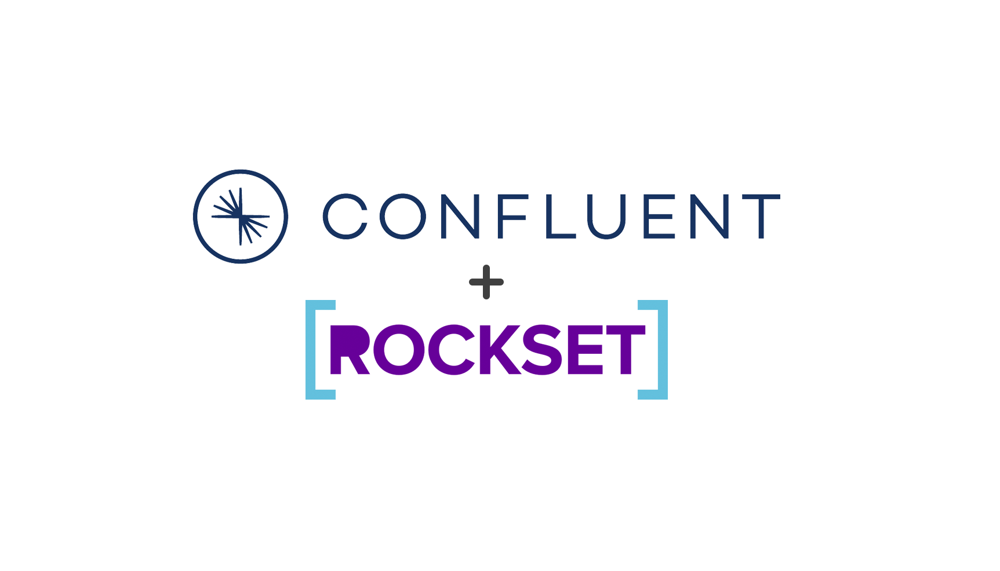

<div align="center">
    
</div>

# <div align="center">Real-time Semantic Search</div>

In this exercise we will demonstrate how to use event streaming and vector search to support real-time semantic 
search by combining two fully managed cloud services, Confluent Cloud and Rockset. Event streaming allows 
loosely coupled but highly integrated systems and applications to built and operate at the speed of business. In this particular exercise we use Confluent Cloud to store our events and Apache Flink to enrich them with embeddings from OpenAI. Our semantic search engine is powered by Rockset's [vector search capabilities](https://docs.rockset.com/documentation/docs/what-is-vector-search). 

## Prerequisites

**Confluent**
* Confluent Cloud Account
* Terraform (in order to build everything in Confluent Cloud)
* Docker (in order to run the Kafka Producer and Apache Flink)
* An OpenAI Account with credentials (in order to generate the text embeddings)

**Rockset**
* Rockset Account and API key
* Python (tested on 3.9.9 but 3.9+ should be fine)
* [Rockset Python SDK (1.0.4)](https://github.com/rockset/rockset-python-client/tree/main)

## Confluent

Since you'll need some secrets through this walkthrough, the first thing you should do is create a file for your secrets. This repo will ignore the file `env.sh`, so using that is a safe bet. Start by cloning the repo, then creating the file with the following command. 

```bash 
git clone https://github.com/rocksetlabs/realtime-semantic-search && cd realtime-semantic-search
```

```bash
echo "# Confluent Cloud\nexport CONFLUENT_CLOUD_API_KEY="key"\nexport CONFLUENT_CLOUD_API_SECRET="secret"\n# OpenAI API Key\nexport OPENAI_API_KEY="key"" > env.sh
```

With the secrets file created, go to Confluent Cloud and create Cloud API Keys (guide [here](https://docs.confluent.io/cloud/current/access-management/authenticate/api-keys/api-keys.html#cloud-cloud-api-keys)) and paste the values into the secrets file for the key and secret respectively. Next, paste in the value for your OpenAI API Key as well so the Flink processor will be able to create embeddings. With all that complete, source everything to the console so the applications can use them. 

```bash
source env.sh
```

With all the secrets available to the console, you can switch to the Terraform directory where you'll build the necessary Confluent Cloud resources. Follow these next few steps to create everything, and then wait until it's done before moving on. 

```bash
cd terraform && terraform init
```

```bash
terraform plan
```

*When prompted, approve the plan by entering "yes", or provide the "-auto-approve" flag to the apply command.*

```bash
terraform apply 
```

Wait for Terraform to finish creating all the resources, then navigate back to the base directory. 

```bash
cd ..
```

With everything created, you can start building and launching the services that will create and process the product data. Start by building images for the three services. This might take some time but you should only have to do it once. 

```bash
docker compose build
```

With the images built, start the Flink processor so that it will be up and ready when you produce data in the next step.

```bash
docker compose up processor -d
```

Give the service a moment to come online (nothing more than 60 seconds), then launch the producer.

```bash
docker compose up producer -d
```

Now you can go to the Confluent Cloud console and begin looking at the messages. You should see the raw product data in a topic named `products.metadata` and the product data with the embeddings added in a topic named `products.embeddings`. With all that completed, now you should move on to setting up the Rockset components to consume the real-time data to power your semantic search. 

### Update Commands

Once you've set up the Rockset components and have done some querying of the data, you can use the following in order to update a single record to see how real-time the pipeline really is. Start by launching the `updater` service that can produce the updated records. 

```bash
docker compose up updater -d
```

From there, you use the following to commands in order to update the product data for "Battle Hunter". To update "Battle Hunter" to it's original description, use the following. 

```bash
docker compose exec updater java -cp /usr/app/semantic-search-1.0.0.jar com.github.zacharydhamilton.producer.MetadataProducer topic=products.metadata clientId=metadata-producer metadataFile=/usr/app/data/battle_hunter_original.json.gz
```

To update the description to a better, more realistic description, use the following. 

```bash
docker compose exec updater java -cp /usr/app/semantic-search-1.0.0.jar com.github.zacharydhamilton.producer.MetadataProducer topic=products.metadata clientId=metadata-producer metadataFile=/usr/app/data/battle_hunter_updated.json.gz
```

You can cycle between these as many times as you like. Each will produce a single event to Confluent, and Rockset will store only the latest value you produced. 


## Rockset

For the Rockset portion we used Python to set up everything and test our queries. You may need to change the region defined in the script if it is not usw2a1.

```python
region = Regions.usw2a1
```

Once your data is flowing into the topic `product.embeddings`, you can set the following environment variables 
and run the setup script. This will create your integration with Confluent Cloud, create your Rockset collection and query lambdas.

```bash
export CC_APIKEY=<your Confluent Cloud api key>
export CC_SECRET=<your Confluent Cloud secret>
export CC_BOOTSTRAP_SERVERS=<your Confluent Cloud bootstrap server>
export ROCKSET_APIKEY=<your Rockset API Key>

python rockset_setup.py
```

In a couple of minutes your collection should be ready and populated. You can check the collection status and 
document count in the console. If you used the data from this repo there should be 10,874 documents.

Now we can set our OpenAI org and api key.
```bash
export OPENAI_ORG=<your OpenAI org>
export OPENAI_API_KEY<your OpenAI API key>
```

If you didn't already set your Rockset API key in the previous step you should do that as well.
```bash
export ROCKSET_APIKEY=<your Rockset API Key>
```

With everything set we can run the search script.
```bash
python webinar_vector_search.py
```

You will be prompted to enter the input variables and then see the results. Feel free to try different 
inputs and compare the differences between vector search and full text search.

## Clean-up

**Confluent**
* Make sure you stop all the Docker services. `docker compose down`
* Make sure you navigate back to the `terraform/` directory and destroy the components in Confluent Cloud. `terraform destroy`

**Rockset**
* If you changed VI size for testing, make sure to scale down.
* You can delete your query lambdas, collection and integration when you are done in the console.
